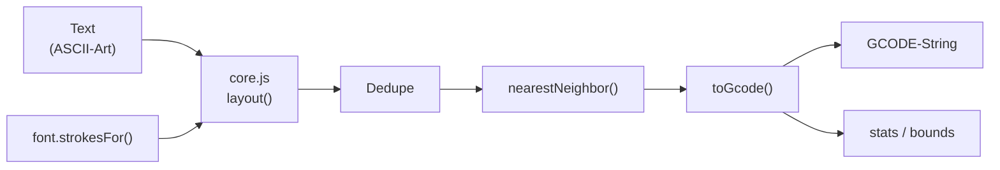

# ASCII Art Plotter

**GCODE-Generator für CNC-Maschinen** — druckt ASCII-Art mit Filzstift auf T-Shirts.

Statische Browser-App, läuft direkt per `file://` (keine ES-Module zur Laufzeit, kein Build-Server, kein Backend). Die UI ist in **CoffeeHaml** (dantiel) geschrieben und wird einmalig zu einer React-Komponente vorkompiliert.

---

## Was es kann (Abnahme-Kriterien)

| Kriterium | Umsetzung |
| --- | --- |
| UI lädt ohne Fehler | `open index.html` — React rendert die vorkompilierte `CoffeeHamlApp` |
| Sichtbare ASCII-Art-Vorschau | Eingebauter 5×7-Pixelfont + 5 eingebettete Fonts (offline, garantiert sichtbar) + Canvas-Vorschau |
| **Eingebettete Fonts** | Syne Mono, Turret Road, **Turret Road Mono** (monospaced Ableitung), Olympia Congress, Olympia Script — per Dropdown wählbar, inkl. Editor-Vorschau |
| GCODE korrekt & herunterladbar | `AsciiPlotter.layout()` → GCODE-String, Download als `.gcode` |
| **Einzelstrich** statt Outline | Skeletonisierung (Medial Axis) statt Kontur-Tracing — ein Strich pro Balken |
| Ecken **und** Rundungen | Ecken = Polyline-Segmente (G1), Rundungen = Kreis-Fitting → G2/G3 |
| Breite via Druck + Geschwindigkeit | `zDown(w) = -(press + w·zGain)`, `feed(w) = feedDown − w·(feedDown − feedMin)` — **keine** parallelen Füllstriche |
| Keine Dwells | Garantiert kein `G4` irgendwo (Filzstift blutet sonst durch) |
| Minimierte Lift-Bewegungen | Nächster-Nachbar-Heuristik mit Stroke-Reversal + Spatial Hash |
| **Fein-Zoom & HiDPI** | Mausrad-Zoom (5 %–40000 %), Verschieben per Drag, Doppelklick = Einpassen, `devicePixelRatio`-scharf |
| **Linienführung** | Kurvenmodus (Bögen G2/G3 ↔ Linien G1), Min-Bogenradius, Bogen-Toleranz, Ecken-Splitt-Winkel |
| **Layout-Steuerung** | Schriftgröße, Zeichen-/Zeilenabstand, Rand, Arbeitsfläche, X/Y-Ausrichtung |
| **Generations-Strategien** | Nächster Nachbar / Reihen / Serpentine, Dedupe-Toleranz, Mindest-Strichlänge |

## Quickstart

```sh
node build.mjs         # main.chaml → assets/js/ui.generated.js (einmalig)
node tools/smoke.mjs   # Engine-Tests + Beispiel-GCODE
open index.html        # App im Browser (file://, kein Server nötig)
```

Arbeitsablauf im Browser: Text einfügen → Schriftart wählen (Pixel-Font / 5 eingebettete Fonts / eigene TTF-OTF) → Stift & Parameter wählen → Vorschau prüfen → `.gcode` speichern.

## Architektur

```
Text (ASCII-Art)
  → layout(): Zeilen/Spalten-Raster (col·(cellW+letterSpacing), row·(cellH+lineSpacing))
  → font.strokesFor(ch): Einzelstriche (Mittelachsen) als Segmente (Glyphenraum, y-up)
  → contourToWorld(): Skalierung + Y-Spiegelung + Ecken-Split (cornerSplitDeg)
  → Dedupe (dedupeEps) + Mikro-Stroke-Pruning (minStrokeLen)
  → Kurvenmodus: Bögen < minArcRadius (bzw. alle bei 'lines') zu Linien flachen
  → Ausrichtung: Ursprung-Normalisierung + Margin + pageW/pageH + alignX/alignY
  → globale Breiten-Normalisierung (dünnster Strich → w=0, dickster → w=1)
  → Anordnung: nearestNeighbor / orderRows (Reihen/Serpentine) + Stroke-Reversal
  → toGcode(): GCODE-Erzeugung (Z-Druck + Feed pro Segment aus w)
  → { strokes, gcode, stats, bounds }
=======
```



### Dateien

| Pfad | Rolle |
| --- | --- |
| `index.html` | Shell + Skript-Kaskade (`react → react-dom → opentype → runtime → strokefont → core → ui.generated → main`) |
| `main.chaml` | **UI-Quelle in CoffeeHaml** (Haml-Struktur, CoffeeScript-Ausdrücke, React-Laufzeit) |
| `build.mjs` | Kompiliert `main.chaml` → `assets/js/ui.generated.js` (1 Datei pro Prozess — CoffeeHaml leakt globalen State) |
| `assets/js/runtime.js` | jsx-runtime-Shim (Globals `jsx`/`jsxs`/`Fragment` → `React.createElement`) |
| `assets/js/strokefont.js` | Font→Einzelstriche: Skeletonisierung (Chamfer-Distanz → Zhang-Suen → Achsen-Tracing) für den 5×7-Pixelfont **und** TTF/OTF (Rasterung + Skeleton), RDP + Kreis-Fitting für **Ecken/Rundungen** |
| `assets/js/core.js` | ASCII-Raster, Dedupe, Wege-Optimierung (Nächster-Nachbar + Reversal), GCODE-Erzeugung |
| `assets/js/main.js` | State, React-Mounting, Canvas-Vorschau, Download |
| `assets/css/style.css` | Dunkles Hermetik-Theme |
| `assets/vendor/` | Minifizierte Drittanbieter-Bundles (React, ReactDOM, opentype.js) |
| `samples/hello_world.gcode` | Beispielausgabe |
| `tools/smoke.mjs` | Node-Smoke-Test (Kreis-Fit, G2/G3, Kein-Dwell-Invariante) |

## GCODE-Format

```
G21                 ; Einheiten: Millimeter
G90                 ; Absolute Koordinaten
G0 Z3              ; Stift anheben (Hubhöhe)
G0 X.. Y.. F2400   ; Eilgang pen-up (feedUp)
G1 Z-0.3 F400      ; Stift absenken (plunge) — Druck für dünne Striche
G1 X.. Y.. Z-1.0 F300   ; Linie (dicker Strich: tiefer + langsamer)
G2 X.. Y.. I.. J.. ; Bogen (Rundungen), I/J = Mittelpunkts-Offset
G0 Z3              ; Stift anheben
...
G0 X0 Y0           ; Parkposition
M30                ; Programmende
```

**Strichbreite via Druck + Geschwindigkeit** (keine parallelen Füllstriche):

```
zDown(w) = -(press + w × zGain)           // dicker = tiefer gedrückt
feed(w)  = feedDown − w × (feedDown − feedMin)   // dicker = langsamer
```

`w ∈ [0,1]` ist die normalisierte lokale Mittelachsen-Breite (dünnster Strich des Motivs → 0, dickster → 1). Der Filzstift wird für dicke Striche tiefer gedrückt **und** langsamer geführt (mehr Tinte). Kein Dwell (`G4`) irgendwo: der Stift würde durchbluten. Pen-Up-Wege werden per Nächster-Nachbar-Heuristik minimiert.

**Y-Spiegelung**: Weltkoordinaten sind X rechts / Y nach unten (wie Canvas). GCODE ist X rechts / Y nach oben — daher wird `Y` beim Schreiben negiert.

## Weiterführendes

- **[API_REFERENCE.md](API_REFERENCE.md)** — vollständige API-Referenz (Font-Interface, `layout()`, Parameter, Segment-Modell, GCODE-Detail)
- **[TROUBLESHOOTING.md](TROUBLESHOOTING.md)** — Deployment, Build-Pipeline & Fehlerdiagnose